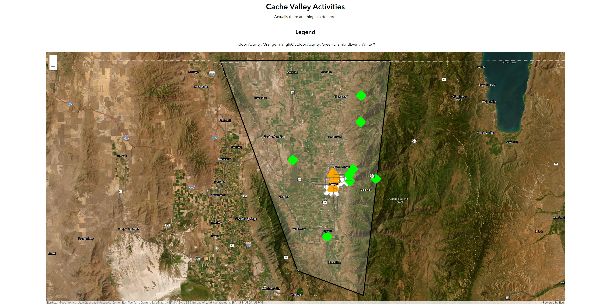

# Overview

I wanted to learn what GIS Mapping is and how it can be used.

I thought a great use would be to create a catalogue of things to do around the valley I grew up in. I remember having a hard time finding something to do even though there is lots and having a map and a way to sort through it would help a lot. Right now you zoom and pull across the map with your cursor or touchscreen and select a marker based on what you are interested in doing. I gathered the data from my own experiences there and an upcoming events feed from the area.

My goal in writing this software was to become familiar with ArcGIS and GIS mapping in general. It was also to build an interesting app that could potentially find people still living something fun to do based on their mood.

[Software Demo Video](https://youtu.be/24smo_N5rd8)

# Development Environment

I used VS Code with a live server extension to hot reload tests in Chrome. I used the free version of ARCGIS.

The new technology was the ARCGIS JavaScript SDK. I also used HTML, CSS and vanilla JavaScript.

# Useful Websites

- [arcgis.com](https://developers.arcgis.com/javascript/latest/api-reference/esri-Graphic.html)
- [arcgis.com latest](https://developers.arcgis.com/javascript/latest/)
  Helped me get started.
- [youtube.com](https://www.youtube.com/watch?v=grtAU6RlZiM)

The ArcGIS documentation is messy and difficult to sort through so using ChatGPT to parse through a good chunk of the noise was very helpful. This allowed me to find out what part of the library to use then I could investigate further on my own.

- [ChatGPT](chat.openai.com)

# Future Work

- Externalize JSON
- Finalize data point structures for sorting
- Create filters
- Streamline point design
